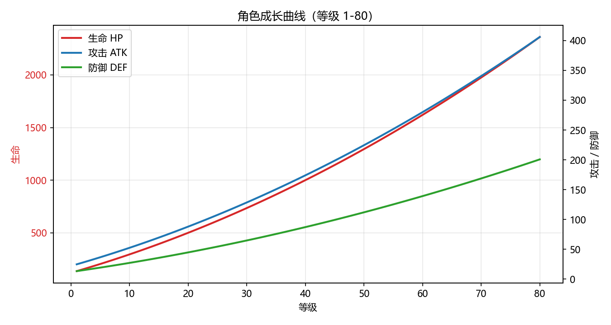
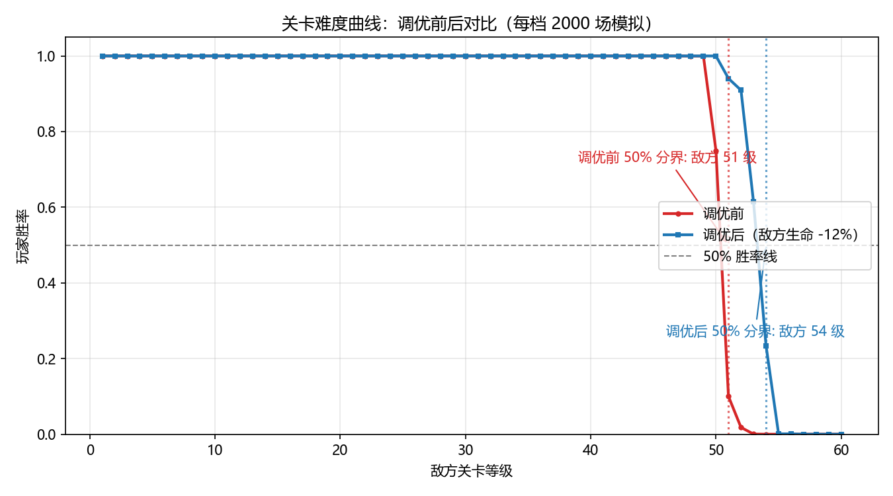
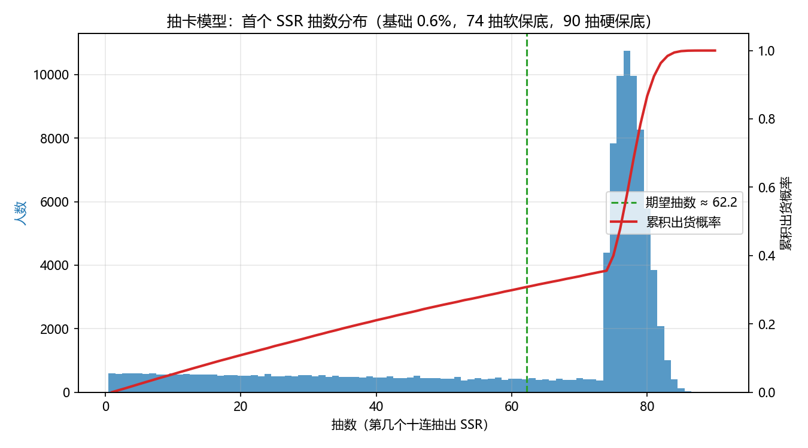

# 卡牌养成游戏数值平衡模拟 Demo

一个可直接运行的数值策划练习项目：覆盖**成长曲线设计 → 战斗平衡模拟 → 发现
问题 → 调优 → 再验证 → 输出报告**的完整工作流，并附带抽卡保底模型。

## 快速开始

```bash
cd game_numeric_demo
pip install -r requirements.txt
python main.py
```

Windows 也可以直接双击 `run_demo.bat`。

## 效果展示

运行一次 `python main.py` 即可得到以下成果物：







完整分析见 [outputs/balance_report.md](outputs/balance_report.md)。

## 输出产物（outputs/）

| 文件 | 说明 |
| --- | --- |
| growth_curves.png | 角色成长曲线（等级 1-80） |
| winrate_before_after.png | 调优前后关卡胜率对比 |
| gacha_distribution.png | 抽卡出货分布与累积概率 |
| stats_by_level.csv | 等级数值表（可导入 Excel） |
| winrate.csv | 胜率明细 |
| gacha_summary.csv | 抽卡关键指标 |
| balance_report.md | 完整调优报告 |

## 文件结构

| 文件 | 作用 |
| --- | --- |
| combat.py | 成长曲线、战斗公式、1v1 回合制战斗 |
| gacha.py | 抽卡概率、软/硬保底、期望抽数 |
| simulator.py | Monte Carlo 战斗模拟器 |
| report.py | 图表、CSV 与 Markdown 报告 |
| main.py | 一键运行入口 |


